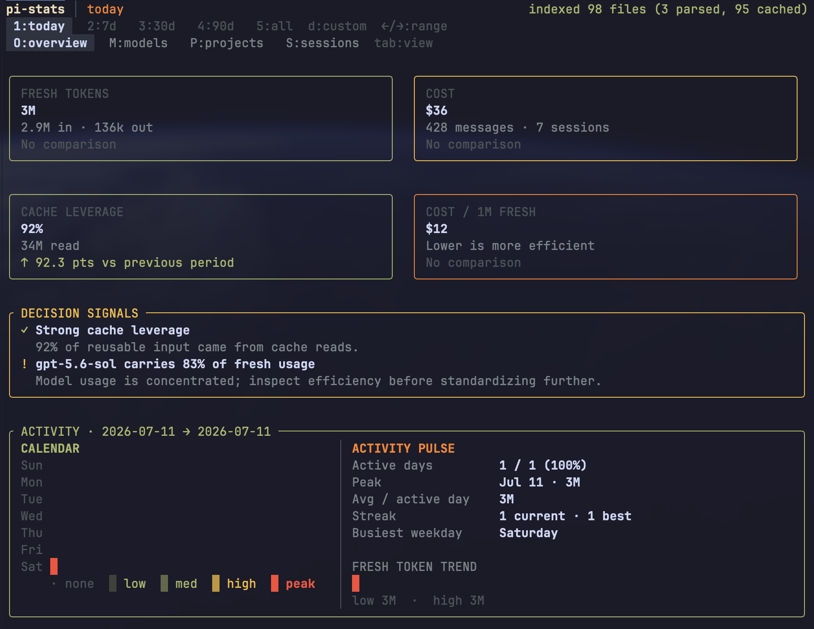
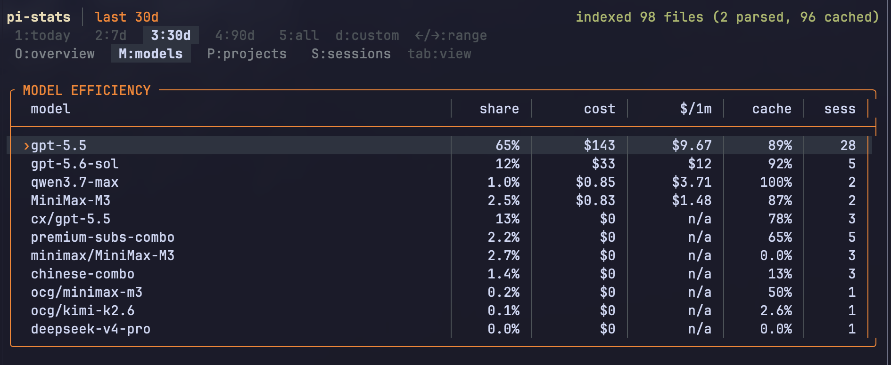

# pi-stats-ext

[](https://www.npmjs.com/package/pi-stats-ext)

Local-first Pi coding-agent usage dashboard.





## Dashboard

`/pi-stats` opens a dense Ops-console TUI over local session history:

- global date ranges: default `30d`, plus `today`, `7d`, `90d`, `all`, or `YYYY-MM-DD..YYYY-MM-DD`
- multi-view layout: Overview, Models, Projects, Sessions
- responsive, Pi-theme-aware summary cards for fresh tokens, cost, cache leverage, and cost per million fresh tokens
- previous-period comparisons that expose changes in spend, usage, cache leverage, and efficiency
- decision signals for cost shifts, cache regressions, stable usage, and model concentration
- responsive Activity panel with a calendar heatmap, collision-free month labels, active-day cadence, peak/average usage, streaks, busiest weekday, and a fresh-token trend
- keyboard-driven model efficiency table with usage share, cost, cache leverage, and cost per million fresh tokens
- model inspector with provider, reach, efficiency baseline, and a practical routing recommendation
- bordered tables for projects and sessions by cost/tokens
- keyboard controls: `1` today, `2` 7d, `3` 30d, `4` 90d, `5` all, `d` custom date input, `o`/`m`/`p`/`s` views, tab cycles views, left/right cycles range, up/down or `j`/`k` selects a model, enter inspects it, `q`/`esc` closes
- incremental JSON cache at `~/.pi/agent/pi-stats/cache.json`

## Installation

### npm

```bash
pi install npm:pi-stats-ext
```

Then reload Pi and run:

```text
/pi-stats
```

### Local development install

```bash
npm install
pi install ./
# then reload pi and run:
/pi-stats
```

## Develop

```bash
npm test
npm run build
```
